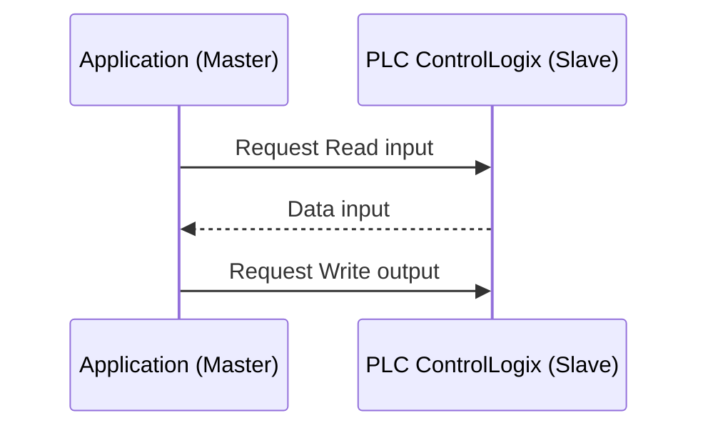
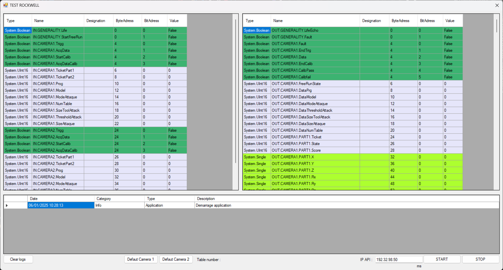

<a id="readme-top"></a>

# RockwellCommunication

RockwellCommunication est une librairie C# qui encapsule la librairie ➡️[libplctag](https://github.com/libplctag/libplctag) et ajout une fonctionnalité de lecture/écrire périodique à partir d'un UDT d'entrée et un UDT de sortie. 


Les UDT peuvent être exportés depuis le logiciel AB/Rockwell au Format L5X. 


<!-- APP -->
<div align="center">
  <a href="https://github.com/tonycab/BarCodeToPlc">
    
  </a>
</div>

> [!NOTE]
> L'UDT ne doit contenir que des types : BOOL,UINT,INT,UDINT,DINT,REAL

> [!WARNING]
> Uniquement testé avec un automate AB / Rockwell type : ControlLogix

## 1 - Exemple

Contructeur :
  ```C#
     eip = new EthernetIP("192.32.98.50", "1.0", "Vision_Out", "Vision_In");
     eip.ImportUdtInput("UDT_VISION_OUT.L5X");
     eip.ImportUdtOutput("UDT_VISION_IN.L5X");
```

"Vision_Out" et "Vision_In" sont deux Tag déclarés dans le programme automate. les méthodes "ImportUdtInput" et "ImportUdtOutput" permettent d'importer les UDTs.
Les variables sont alors disponible dans un dictionnaire. Les noms des variables commence par "IN." ou "OUT." et respecte ensuite le nom de la structure UDT.

Evènnement :
 ```C#
   //Bit de vie communication
   eip["IN.GENERALITY.Life"].SignalChanged += (s) =>
   {
     eip["OUT.GENERALITY.LifeEcho"].Value = s.Value;
   };
```

## 2 - AMELIORATION A FAIRE

- [ ] Gérer d'autres types de données

## 3 - INFORMATION
> [!NOTE]
> L'application utilise ➡️[libplctag](https://github.com/libplctag/libplctag) pour communiquer avec l'automate Rockwell.

<p align="right">(<a href="#readme-top">Back to top</a>)</p>
